# Parte 1: Bases de Datos

## 1. Tipo de Base de Datos

La **base de datos de un centro médico** presentada en la consigna se puede clasificar según su estructura y función como relacional y transaccional, respectivamente. Es una base de datos **relacional**, porque maneja relaciones entre las distintas entidades involucradas  (pacientes,  médicos, recetas, consultas), y utiliza tablas con filas y columnas. Además, está diseñada para un sistema que requiere integridad referencial, consultas SQL y normalización.

Según la función, se clasifica como **transaccional**, porque la base almacena datos de operaciones que se realizan en tiempo real (consultas, recetas, pacientes, etc.). Las funciones clave incluyen inserciones, actualizaciones y búsquedas, es decir: registro y gestión de transacciones clínicas. No se trata de una base *Data Warehouse* porque su uso previsto no es realizar análisis de datos, tampoco es *In-Memory* porque no está especificado para trabajar en memoria para alto rendimiento (consultas rápidas), ni una base de datos *data lakes*, porque no almacena grandes volúmenes de datos.

## 2. Diagrama Entidad-Relación

Un **Diagrama Entidad-Relación (DER)** es una representación gráfica del modelo de datos de una base de datos. Su objetivo es mostrar:

* **Entidades:** Son objetos del mundo real con existencia propia (por ejemplo, "Paciente", "Médico").
* **Atributos:** Son las propiedades o características de las entidades (por ejemplo, "nombre", "fecha de nacimiento").
* **Relaciones:** Son asociaciones entre entidades (ejemplo, un "Médico" que emite una "Receta").
* **Cardinalidades:** Indican cuántas veces una entidad puede participar en una relación.
* **Primary Key (PK):** Atributo que identifica unívocamente a cada instancia de una entidad.
* **Foreign Key (FK):** Atributo que conecta una entidad con otra (relación referencial).

.png)

En la imagen anterior se observa el Diagrama Entidad-Relación que representa el funcionamiento digital de un **centro médico**. Las distintas partes involucradas son:

* **Entidades:** `Paciente` (atributos: `Nombre`, `Fecha de nacimiento`), `Médico` (`Nombre`, `Especialidad`), `Receta` (no tiene atributos propios en este modelo), y `Consulta` (`Fecha`, `Tratamiento`, `Enfermedad`).
* **Relaciones:** `emite` (entre Paciente, Médico y Receta) y `incluye` (entre Receta y Consulta). Una receta puede incluir muchas consultas y una consulta puede estar relacionada con muchas recetas (relación N\:N).

Este diagrama refleja con claridad la estructura necesaria para registrar las actividades en un centro médico. No están detalladas las claves primarias o foráneas ni se incluyen direcciones.

## 3. Modelo lógico entidad-relación

El modelo lógico es una traducción del diagrama entidad relación a un modelo que se pueda implementar directo en un sistema de gestión de base de datos, como SQL. Se diferencia del anterior porque:

* Usa tablas para representar entidades y relaciones.
* Define tipos de datos para cada atributo.
* Establece de forma explícita las claves.
* Está más cerca de la implementación final.

En el caso del centro médico, se definieron las tablas **`Paciente`, `Médico`, `Consulta` y `Receta`**, representando las entidades principales del sistema. Para cada una se detallan sus atributos, especificando el tipo de dato y las restricciones asociadas, como claves primarias, claves foráneas y condiciones de obligatoriedad.

### Tabla: Paciente

| Atributo          | Tipo de Dato | Restricciones       |
| ----------------- | ------------ | ------------------- |
| id\_paciente      | INT          | PK, AUTO\_INCREMENT |
| nombre            | VARCHAR(100) | NOT NULL            |
| fecha\_nacimiento | DATE         | NOT NULL            |
| sexo              | CHAR(1)      | NOT NULL            |
| calle             | VARCHAR(100) | NOT NULL            |
| numero            | INT          | NOT NULL            |
| ciudad            | VARCHAR(100) | NOT NULL            |

### Tabla: Médico

| Atributo        | Tipo de Dato | Restricciones       |
| --------------- | ------------ | ------------------- |
| id\_medico      | INT          | PK, AUTO\_INCREMENT |
| nombre          | VARCHAR(100) | NOT NULL            |
| especialidad    | VARCHAR(100) | NOT NULL            |
| direccion\_prof | VARCHAR(150) | NOT NULL            |

### Tabla: Consulta

| Atributo     | Tipo de Dato | Restricciones       |
| ------------ | ------------ | ------------------- |
| id\_consulta | INT          | PK, AUTO\_INCREMENT |
| id\_paciente | INT          | FK → Paciente(id)   |
| id\_medico   | INT          | FK → Médico(id)     |
| fecha        | DATE         | NOT NULL            |
| tratamiento  | TEXT         |                     |
| enfermedad   | VARCHAR(100) | NOT NULL            |

### Tabla: Receta

| Atributo     | Tipo de Dato | Restricciones       |
| ------------ | ------------ | ------------------- |
| id\_receta   | INT          | PK, AUTO\_INCREMENT |
| id\_paciente | INT          | FK → Paciente(id)   |
| id\_medico   | INT          | FK → Médico(id)     |
| fecha        | DATE         | NOT NULL            |
| medicamento  | VARCHAR(100) | NOT NULL            |
| indicacion   | TEXT         |                     |
| enfermedad   | VARCHAR(100) | NOT NULL            |

## 4. Normalización

La **normalización** es un proceso para estructurar la base de datos eliminando redundancias, mejorando la integridad y facilitando el mantenimiento. Las formas más comunes son:

* **1FN (Primera Forma Normal):** Eliminar atributos repetidos. Cada campo debe tener un único valor atómico.
* **2FN (Segunda Forma Normal):** Eliminar dependencias parciales (aplica a claves compuestas).
* **3FN (Tercera Forma Normal):** Eliminar dependencias transitivas. Cada campo no clave debe depender solo de la clave primaria.

### Evaluación

* ✅ Cumple 1FN: Cada tabla tiene valores atómicos (una sola ciudad, nombre, etc.).
* ✅ Cumple 2FN: Las claves primarias son simples (ID autoincremental). No hay dependencias parciales.
* ⚠️ Cumple parcialmente 3FN: Hay algunas dependencias transitivas y redundancias. Por ejemplo, en la columna `ciudad` de la tabla `Pacientes` hay múltiples variantes para la misma ciudad ("Buenos Aires", "buenos aires", etc.).

### Conclusión

La base de datos cumple con la Primera y Segunda Forma Normal. Además, tiene un buen grado de normalización en Tercera Forma Normal, gracias a la inclusión de tablas separadas para especialidades médicas, sexo biológico y medicamentos. No obstante, se recomienda mejorar la gestión de ciudades en la tabla de pacientes mediante la creación de una tabla de ciudades referenciada por clave foránea para evitar redundancias y errores de escritura.


---

# Parte 2: Consultas SQL

## Consulta 01

Cuando se realizan consultas sobre la tabla paciente agrupando por ciudad los tiempos de respuesta son demasiado largos. Proponer mediante una query SQL una solución a este problema.

Para reducir los tiempos de respuesta de las consultas agrupadas por ciudad que se hacen sobre la tabla paciente, lo que se puede hacer es crear un índice en base a la columna ciudad de esta misma tabla. Esto se debe a que el índice permite que la base de datos acceda a los valores de esa columna de forma más eficiente, sin tener que recorrer la tabla fila por fila. Luego de crear el índice, las agrupaciones por ciudad se procesarían usando este índice haciendo que las consultas como GROUP BY, ORDER BY entre otras se ejecutan más rápido.

```sql
CREATE INDEX indice_pacientes_ciudad
ON Pacientes (ciudad);

SELECT indexname, indexdef
FROM pg_indexes
WHERE tablename = 'pacientes';

```
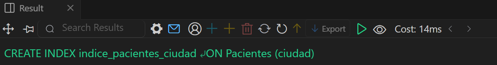
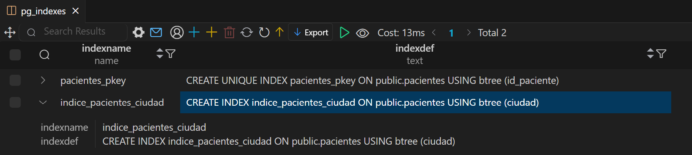

## Consulta 02 

Se tiene la fecha de nacimiento de los pacientes. Se desea calcular la edad de los pacientes y almacenarla de forma dinámica en el sistema ya que es un valor típicamente consultado, junto con otra información relevante del paciente.

En este ejercicio, no queremos guardar la edad como una columna fija en la base de datos porque se desactualiza con el tiempo. 
Por lo que la solución sería crear una vista que incluya la edad calculada de forma dinámica. Adicionalmente, unimos dos tablas, 
la tabla pacientes y la tabla sexobiologico para crear una vista que contenga la edad calculada junto con la descripción del sexo para poder 
mostrar la información relevante del paciente de manera directa sin tener que hacer consultas combinadas. 

```sql
CREATE VIEW vista_pacientes_con_edad AS
SELECT 
  Pacientes.id_paciente,
  Pacientes.nombre,
  Pacientes.fecha_nacimiento,
  EXTRACT(YEAR FROM age(CURRENT_DATE, Pacientes.fecha_nacimiento)) AS edad,
  SexoBiologico.descripcion AS sexo,
  Pacientes.numero,
  Pacientes.calle,
  Pacientes.ciudad
FROM 
  Pacientes
JOIN 
  SexoBiologico ON Pacientes.id_sexo = SexoBiologico.id_sexo;

```

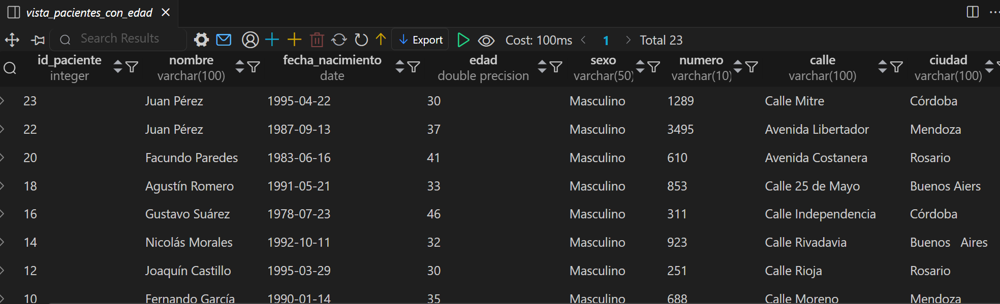

## Consulta 03

La paciente, “Luciana Gómez”, ha cambiado de dirección. Antes vivía en “Avenida Las Heras 121” en “Buenos Aires”, pero ahora vive en “Calle Corrientes 500” en “Buenos Aires”. Actualizar la dirección de este paciente en la base de datos.

```sql
UPDATE pacientes 
SET calle='Corrientes', numero = '500', ciudad = 'Buenos Aires' -- Se actualiza la ciudad también porque antes estaba escrito como Bs Aires
WHERE nombre='Luciana Gómez'
```

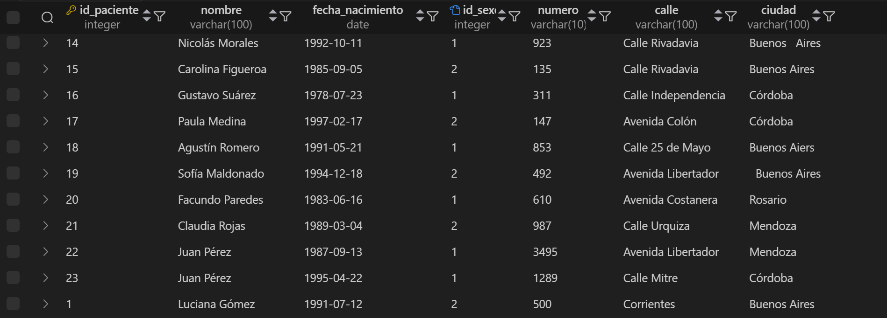

## Consulta 04

Seleccionar el nombre y la matrícula de cada médico cuya especialidad sea identificada por el id 4.

Adicionalmente le colocamos una columna con el ID y la descripción del ID para ver que efectivamente tienen un id igual a 4 y la especialidad a la cual hace referencia.


```sql
SELECT 
  Medicos.nombre AS nombre_medico,
  Medicos.matricula,
  Especialidades.id_especialidad,
  Especialidades.nombre AS especialidad
FROM 
  Medicos
JOIN 
  Especialidades ON Medicos.especialidad_id = Especialidades.id_especialidad
WHERE 
  Especialidades.id_especialidad = 4;  
```

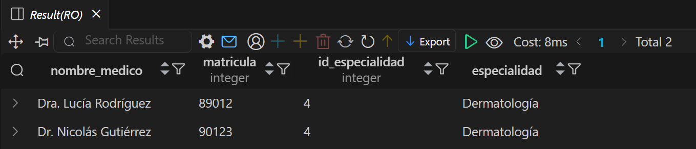

## Consulta 05

Puede pasar que haya inconsistencias en la forma en la que están escritos los nombres de las ciudades, ¿cómo se corrige esto? Agregar la query correspondiente.

Nuestra idea es primero limpiar la columna ciudad de espacios anteriores y posteriores. Luego, armar una tabla con todas las ciudades, 
en este caso provincias de Argentina de forma estandarizada. Y luego usar una extensión de PostgreSQL llamada pg_trgm que se basa en
encontrar similitudes entre textos usando trigramas. Los trigramas son sets de 3 caracteres consecutivos. 
Esta función mide la cantidad de trigramas que comparten dos cadenas de texto y permite calcular la similitud entre ellas. 
De esta forma, se propone tomar cada ciudad de la tabla pacientes, calcular la similitud con cada ciudad de la nueva 
tabla estándar y luego reemplazar la ciudad en la tabla pacientes por la ciudad escrita en formato estándar mas similar. 


```sql

UPDATE Pacientes 
SET ciudad = TRIM(ciudad); --Remueve los espacios anteriores y posteriores

CREATE TABLE Provincia ( -- Creamos una tabla con las provincias escritas de forma estándar
  provincia VARCHAR(100)
);

INSERT INTO Provincia (provincia) VALUES
('Buenos Aires'),
('Córdoba'),
('Santa Fe'),
('Mendoza'),
('Rosario'),
('Tucumán'),
('Salta'),
('Corrientes'),
('Chaco'),
('San Luis'),
('Misiones'),
('San Juan'),
('Neuquén'),
('Jujuy'),
('Entre Ríos'),
('La Rioja'),
('Catamarca'),
('Santiago del Estero'),
('Formosa'),
('Río Negro'),
('La Pampa'),
('Chubut'),
('Santa Cruz'),
('Tierra del Fuego');

CREATE EXTENSION IF NOT EXISTS pg_trgm; --Activa la extensión pg_trgm

SELECT DISTINCT ON (Pacientes.ciudad) -- Busca el mejor match basándose en similitudes de trigramas. Para cada valor de ciudad en la tabla Pacientes, se queda con la fila que tenga la mayor similitud con alguna provincia
  Pacientes.ciudad, -- Tomo la ciudad de la tabla pacientes
  Provincia.provincia, -- Tomo la provincia de la tabla Provincia
  similarity(Pacientes.ciudad, Provincia.provincia) AS similitud -- devuelve un número entre 0 y 1 que representa qué tan parecidas son las dos palabras
FROM Pacientes 
JOIN Provincia ON similarity(Pacientes.ciudad, Provincia.provincia) > 0.3 -- hace un JOIN entre Pacientes y Provincia, solo si la similitud es mayor a 0.3
ORDER BY Pacientes.ciudad, similarity(Pacientes.ciudad, Provincia.provincia) DESC; -- ordena las coincidencias de mayor a menor similitud para cada ciudad para que DISTINCT ON se quede con la más parecida por cada ciudad

UPDATE Pacientes -- actualiza la columna ciudad en la tabla Pacientes con la ciudad bien escrita buscando la provincia de la tabla Provincia con la que tenga mayor similitud
SET ciudad = sub.provincia -- cambia la ciudad por la provincia hallada en la sub query
FROM ( -- subquery que calcula cuál es la provincia más parecida a la ciudad
  SELECT DISTINCT ON (Pacientes.id_paciente) -- selecciona la provincia más parecida a la ciudad 
    Pacientes.id_paciente,
    Provincia.provincia
  FROM Pacientes
  JOIN Provincia 
    ON similarity(Pacientes.ciudad, Provincia.provincia) > 0.3
  ORDER BY Pacientes.id_paciente, similarity(Pacientes.ciudad, Provincia.provincia) DESC -- ordena por similitud de mayor a menor
) AS sub
WHERE Pacientes.id_paciente = sub.id_paciente; -- se actualiza la ciudad con la provincia que tenga mayor similitud en el paciente que corresponde 


```

Primero mostramos la tabla con las ciudades escritas de forma inconsistente:


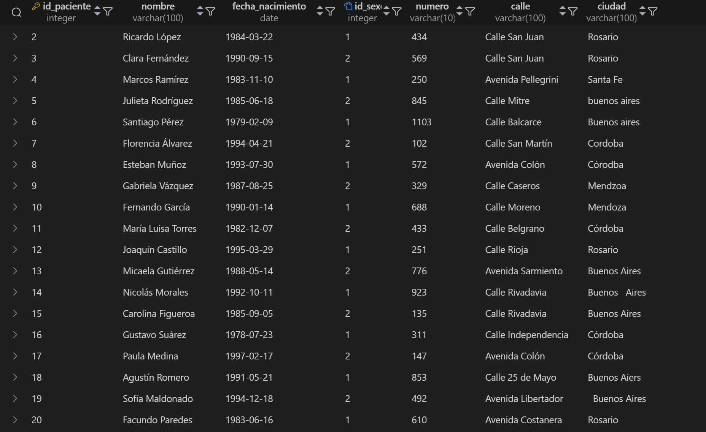

Luego mostramos una porción de la tabla provincias que creamos:


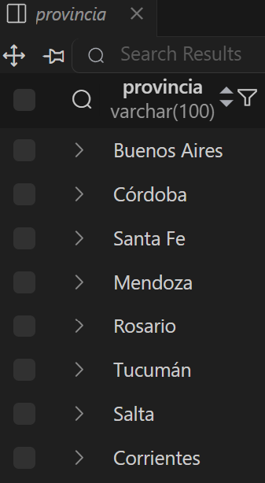

Mostramos lo que arroja ejecutar el cálculo de similitud para cada caso:

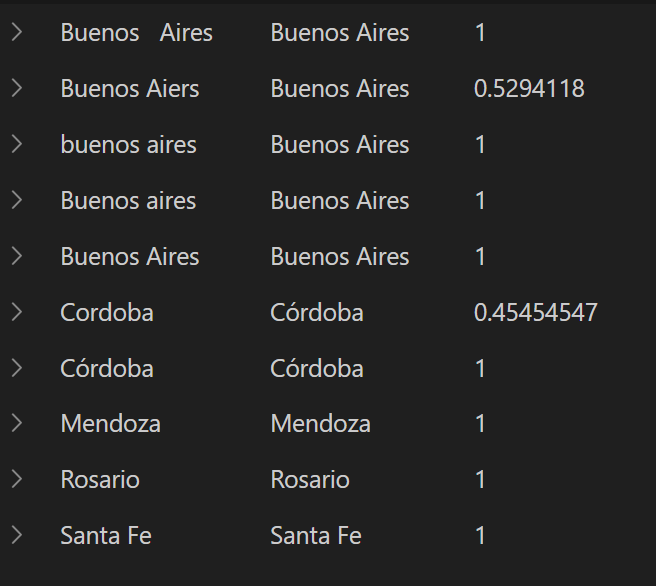


Finalmente mostramos la tabla con las ciudades normalizadas. Es de notar que hicimos pruebas con una similitud de 0.4 primero pero como esto no corregía los casos de Córdoba y Mendoza, bajamos la somilitud a 0.3 y esto permitió corregir todos los casos.

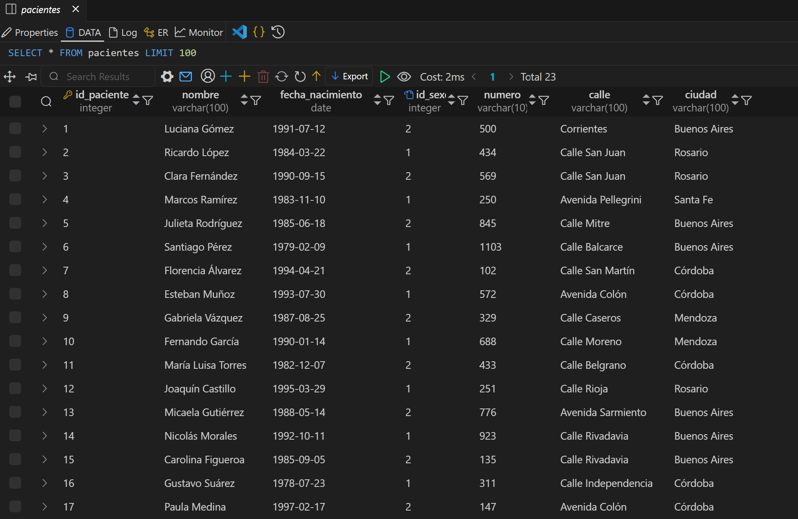

En resumen, lo que hicimos es comparar cada ciudad con todas las provincias, calculando una métrica de similitud. 
Luego, lo ordenamos de mayor a menor similitud y nos quedamos con la más parecida. Y finalmente, actualizamos la tabla pacientes con la opción más parecida. 

## Consulta 06


Obtener el nombre y la dirección de los pacientes que viven en Buenos Aires.


```sql
SELECT 
  nombre,
  calle,
  numero
FROM Pacientes
WHERE ciudad = 'Buenos Aires'; -- Destacamos que como en el punto anterior normalizamos las ciudades, podemos buscar efectivamente 
-- todos los pacientes que viven en Buenos Aires sin tener que usar funciones adicionales como LOWER o TRIM para corregir las inconsistencias que podría haber
```

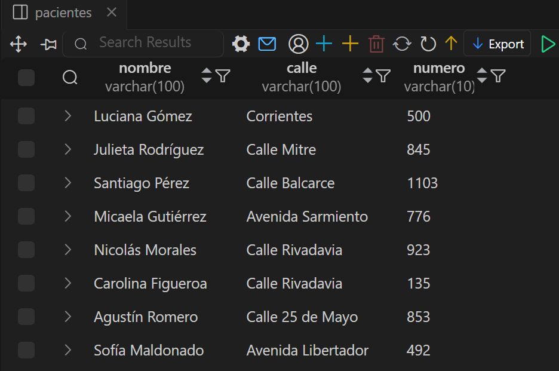


## Consulta 07

Cantidad de pacientes que viven en cada ciudad.

```sql
SELECT ciudad, COUNT(*) AS cantidad_pacientes
FROM Pacientes
GROUP BY ciudad;
```
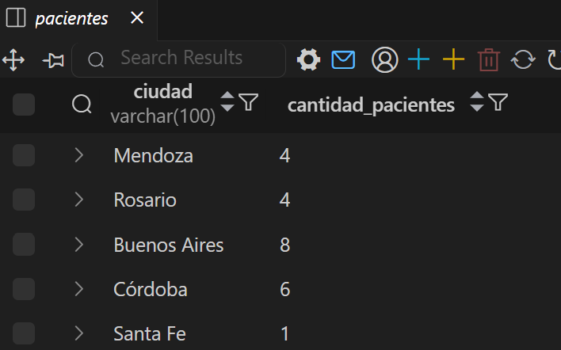


## Consulta 08

Cantidad de pacientes por sexo que viven en cada ciudad.
```sql
SELECT 
  ciudad,
  SUM(CASE WHEN sexobiologico.descripcion = 'Femenino' THEN 1 ELSE 0 END) AS Femenino, -- Cuento la cantidad de pacientes femeninos por cada ciudad
  SUM(CASE WHEN sexobiologico.descripcion = 'Masculino' THEN 1 ELSE 0 END) AS Masculino -- Cuento la cantidad de pacientes masculinos por cada ciudad
FROM pacientes
JOIN sexobiologico ON pacientes.id_sexo = sexobiologico.id_sexo -- El JOIN entre la tabla pacientes y sexobiologico se hace mediante la clave id_sexo para acceder a la descripcion del sexo de cada paciente
GROUP BY ciudad; -- Agrupo por ciudad 

```
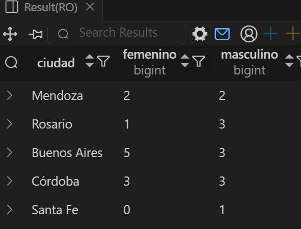

## Consulta 09

Obtener la cantidad de recetas emitidas por cada médico.
```sql
SELECT 
  Medicos.nombre AS medico, 
  COUNT(Recetas.id_receta) AS cantidad_recetas
FROM Recetas 
JOIN Medicos ON Recetas.id_medico = Medicos.id_medico
GROUP BY Medicos.nombre
```

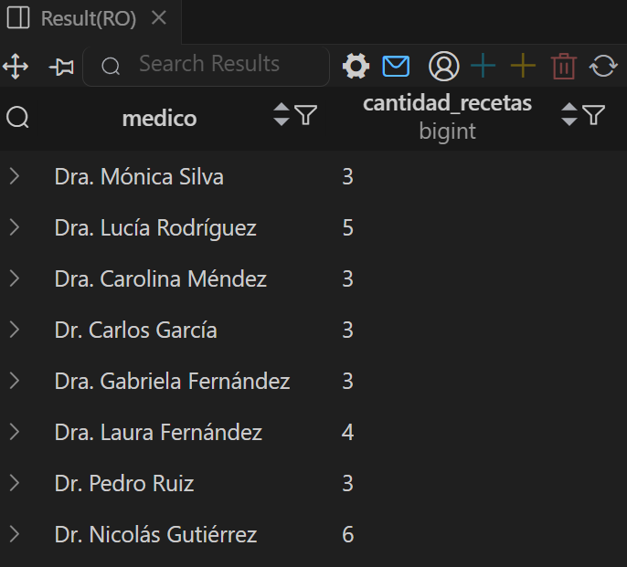

## Consulta 10

Obtener todas las consultas médicas realizadas por el médico con ID igual a 3 durante el mes de agosto de 2024.
```sql
SELECT 
  Consultas.id_consulta,
  Consultas.fecha,
  Pacientes.nombre AS Paciente,
  Consultas.diagnostico,
  Consultas.tratamiento,
  Consultas.snomed_codigo
FROM Consultas 
JOIN Pacientes ON Consultas.id_paciente = Pacientes.id_paciente
WHERE Consultas.id_medico = 3
  AND Consultas.fecha BETWEEN '2024-08-01' AND '2024-08-31' 
```
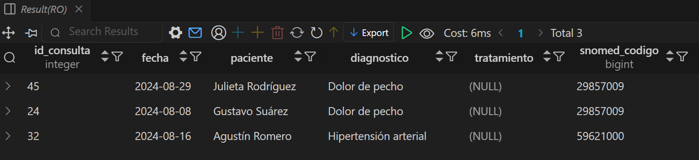


## Consulta 11

Obtener el nombre de los pacientes junto con la fecha y el diagnóstico de todas las consultas médicas realizadas en agosto del 2024.

```sql
SELECT 
  Pacientes.nombre,
  Consultas.fecha,
  Consultas.diagnostico
FROM Consultas
JOIN Pacientes ON Consultas.id_paciente = Pacientes.id_paciente
WHERE Consultas.fecha BETWEEN '2024-08-01' AND '2024-08-31'; 
```

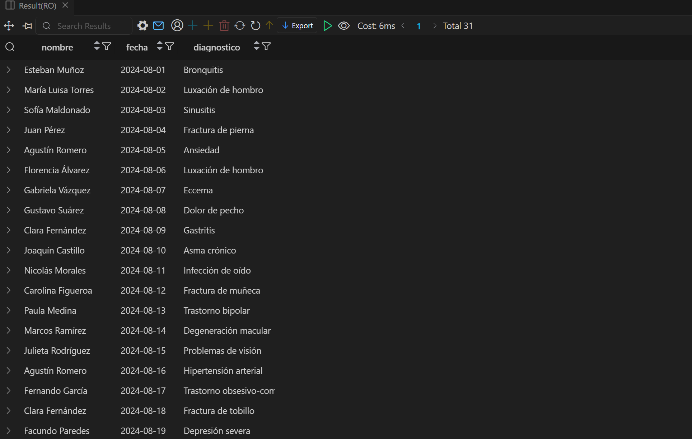
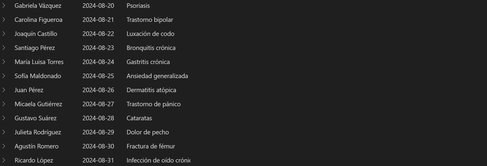


## Consulta 12

Obtener el nombre de los medicamentos prescritos más de una vez por el médico con ID igual a 2.

```sql
SELECT 
  Medicamentos.nombre,
  COUNT(*) AS veces_prescripto
FROM Recetas
JOIN Medicamentos ON Recetas.id_medicamento = Medicamentos.id_medicamento
WHERE Recetas.id_medico = 2
GROUP BY Medicamentos.nombre
HAVING COUNT(*) >= 2; 

```


## Consulta 13

Obtener el nombre de los pacientes junto con la cantidad total de recetas que han recibido

```sql
SELECT 
  Pacientes.nombre,
  COUNT(*) AS cantidad_recetas
FROM Recetas
JOIN Pacientes ON Recetas.id_paciente = Pacientes.id_paciente
GROUP BY Pacientes.nombre; 
```
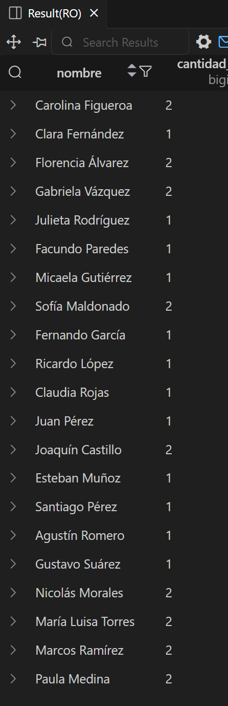

## Consulta 14

Obtener el nombre del medicamento más recetado junto con la cantidad de recetas emitidas para ese medicamento.


```sql
SELECT 
  Medicamentos.nombre AS Medicamento,
  COUNT(*) AS cantidad_de_recetas
FROM Recetas
JOIN Medicamentos ON Recetas.id_medicamento = Medicamentos.id_medicamento
GROUP BY Medicamentos.nombre
HAVING COUNT(*) = (
  SELECT MAX(cantidad)
  FROM (
    SELECT COUNT(*) AS cantidad
    FROM Recetas
    GROUP BY id_medicamento
  ) AS sub
)

```


## Consulta 15

Obtener el nombre del paciente junto con la fecha de su última consulta y el diagnóstico asociado.
``` sql
SELECT DISTINCT ON (Pacientes.id_paciente)
  Pacientes.nombre as Paciente,
  Consultas.fecha as Fecha,
  Consultas.diagnostico as Diagnóstico
FROM Consultas
JOIN Pacientes ON Consultas.id_paciente = Pacientes.id_paciente
ORDER BY pacientes.id_paciente, consultas.fecha DESC;

```

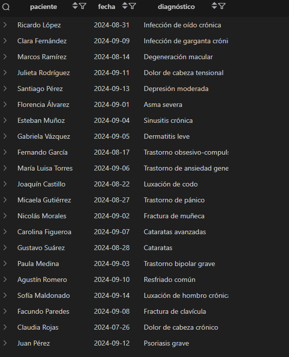

## Consulta 16

Obtener el nombre del médico junto con el nombre del paciente y el número total de consultas realizadas por cada médico para cada paciente, ordenado por médico y paciente.
``` sql
SELECT 
  Medicos.nombre AS medico,
  Pacientes.nombre AS paciente,
  COUNT(*) AS cantidad_de_consultas
FROM Consultas
JOIN Medicos ON Consultas.id_medico = Medicos.id_medico
JOIN Pacientes ON Consultas.id_paciente = Pacientes.id_paciente
GROUP BY Medicos.nombre, Pacientes.nombre
ORDER BY Medicos.nombre, Pacientes.nombre;
``` 
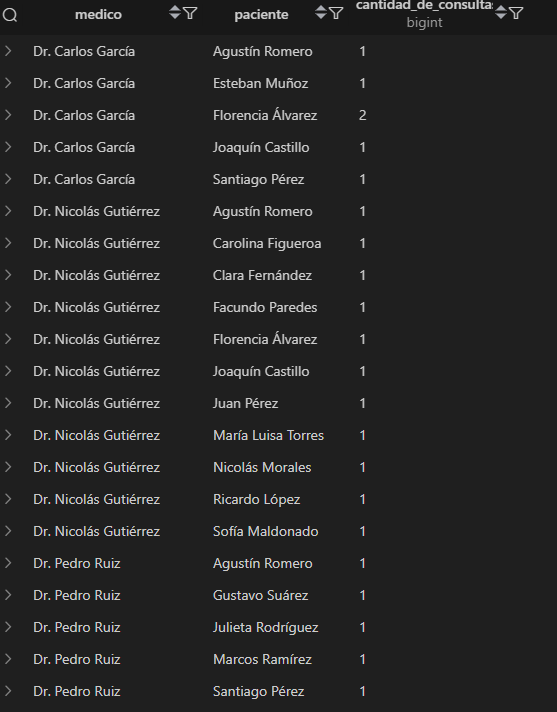

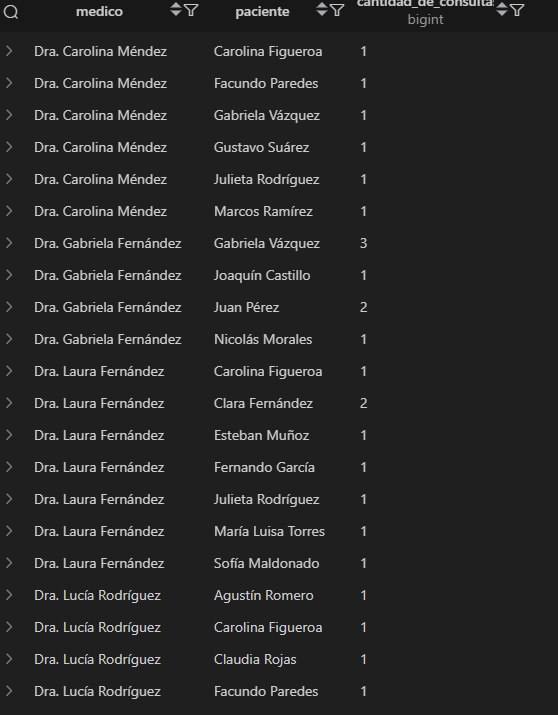

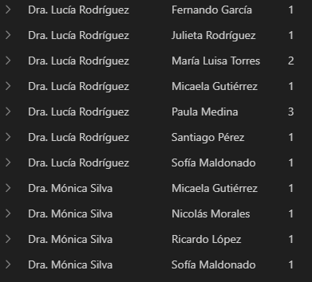

## Consulta 17

Obtener el nombre del medicamento junto con el total de recetas prescritas para ese medicamento, el nombre del médico que lo recetó y el nombre del paciente al que se le recetó, ordenado por total de recetas en orden descendente 
``` sql
SELECT 
  Medicamentos.nombre AS medicamento,
  Medicos.nombre AS medico,
  Pacientes.nombre AS paciente,
  COUNT(*) AS total_recetas
FROM Recetas
JOIN Medicamentos ON Recetas.id_medicamento = Medicamentos.id_medicamento
JOIN Medicos ON Recetas.id_medico = Medicos.id_medico
JOIN Pacientes ON Recetas.id_paciente = Pacientes.id_paciente
GROUP BY Medicamentos.nombre, Medicos.nombre, Pacientes.nombre
ORDER BY total_recetas DESC; 
``` 
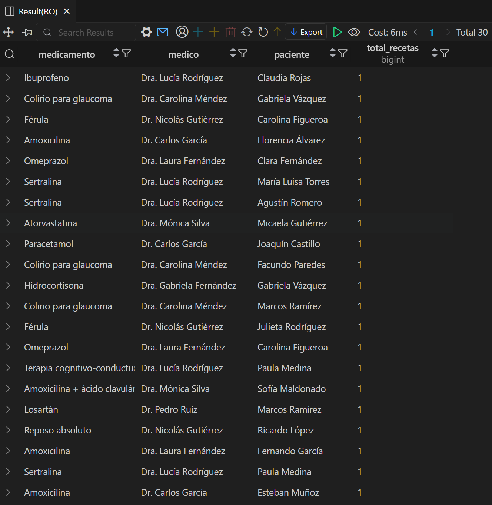
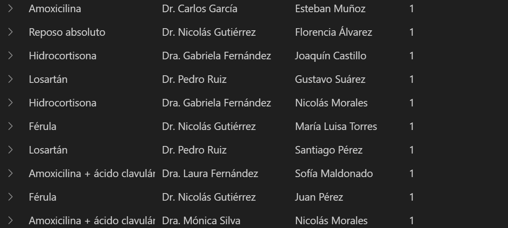

## Consulta 18

Obtener el nombre del médico junto con el total de pacientes a los que ha atendido, ordenado por el total de pacientes en orden descendente.
``` sql
SELECT 
  Medicos.nombre AS medico,
  COUNT(DISTINCT Consultas.id_paciente) AS total_pacientes
FROM Consultas 
JOIN Medicos ON Consultas.id_medico = Medicos.id_medico
GROUP BY Medicos.nombre
ORDER BY total_pacientes DESC; 
```

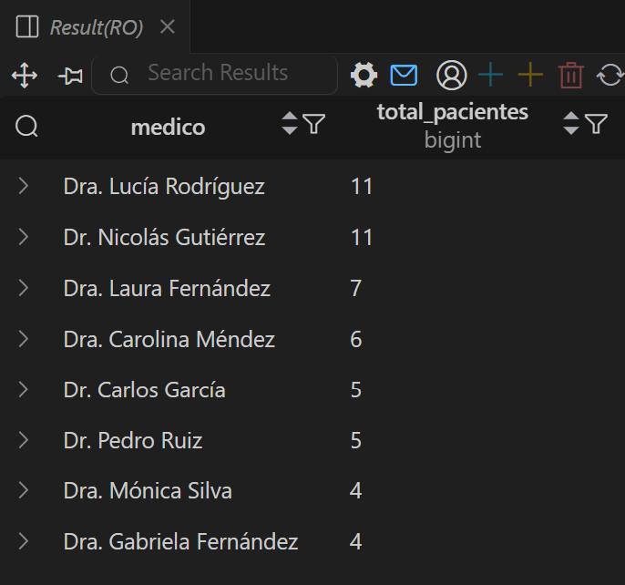

