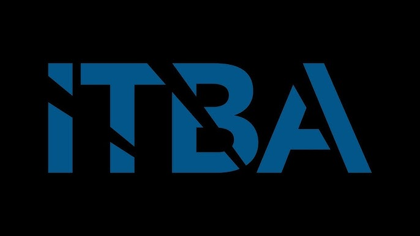

# TP4_Arakaki_Resnik

## Materia
Informática Médica - 16.22 - 1C2025

## Trabajo Práctico
BBDD, SQL y Manejo de Versiones

## Profesoras

* Melina Piacentino
* Eugenia Berrino

## Alumnos
* Arakaki, Ailin
* Resnik, Josefina
  
El presente repositorio constituye el Trabajo Práctico #4 de Informática Médica 16.22 - 20252C realizado por las alumnas Arakaki y Resnik.
En el mismo se analiza una base de datos para un centro de salud, queries de SQL, y la gestión de versiones utilizando Git y GitHub. El trabajo está dividido en tres partes principales:

---

### Parte 1: Bases de Datos
- Análisis del tipo y función de la base de datos
- Diseño del modelo entidad-relación
- Modelo lógico entidad-relación
- Evaluación del grado de normalización

---

### Parte 2: SQL
- 18 consultas SQL sobre la base de datos
---

### Parte 3: Git & GitHub
Se implementó el trabajo en GitHub siguiendo buenas prácticas de colaboración y control de versiones:
- Repositorio público con docentes agregadas al proyecto como colaboradoras
- Commits por consigna y también por integrante
- Uso de branches y Pull Requests 
